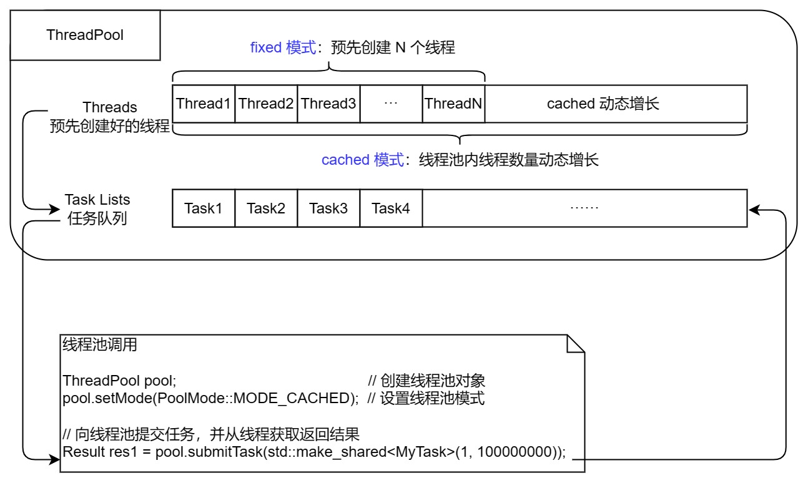

# threadpool



## Table of Contents

+ [Background](#Background)
+ [Install](#Install)
+ [Usage](#Usage)
+ [Docs](#Docs)

## Background

Creating and destroying threads are both very "heavy" operations, which are time-consuming and performance intensive. Therefore, during the process of service execution, if the transaction volume is large and threads are created, executed, and destroyed in real-time after the transaction is completed,  it will lead to a decrease in the real-time performance of the system.

The advantage of the thread pool is that the threads in the thread pool are created in advance at the beginning of the service process startup. When business traffic arrives, threads just need to be allocated. You can directly obtain an idle thread from the thread pool to execute the task. After the task is executed, you do not need to release the thread, but return the thread to the thread pool to continue to provide services for subsequent tasks.

## Install

### Requirements

### Clone

Clone the repository to your local environment:

```bash
$ git clone https://github.com/Chang-Chiang/threadpool.git
```

### Compile

```bash
$ chmod +x autobuild.sh
$ sudo ./autobuild.sh
```

### Test

```bash
$ cd example
$ g++ test.cpp -std=c++17 -lthreadpool -lpthread
$ ./a.out
```

### Uninstall

```bash
# 如果编译的静态库安装在系统目录下则卸载时将其删除
$ sudo rm -rf /usr/include/threadpool
$ sudo rm /usr/lib/libthreadpool.so
```

## Usage

```c++
// write your task class 
class MyTask : public Task {
public:
    MyTask(int begin, int end) : begin_(begin), end_(end) {}

    // here to run your task function
    Any run() {
        std::cout << "tid:" << std::this_thread::get_id() << "begin!" << std::endl;
        std::this_thread::sleep_for(std::chrono::seconds(3));
        uLong sum = 0;
        for (uLong i = begin_; i <= end_; i++) {
            sum += i;
        }
        std::cout << "tid:" << std::this_thread::get_id() << "end!" << std::endl;

        return sum;
    }

private:
    int begin_;
    int end_;
};

 
ThreadPool pool;  // create threadpool object
pool.setMode(PoolMode::MODE_CACHED);  // set the mode

// submit your task to threadpool and get the result
Result res1 = pool.submitTask(std::make_shared<MyTask>(1, 100000000));  
```

## Docs

- [整体架构设计](./docs/整体架构设计.md)
- [线程池类代码设计](./docs/线程池类代码设计.md)
- [线程类代码设计](./docs/线程类代码设计.md)
- [Any 类设计](./docs/Any类设计.md)
- [信号量类设计](./docs/信号量类设计.md)
- [任务基类设计](./docs/任务基类设计.md)
- [线程执行返回值类设计](./docs/线程执行返回值类设计.md)
- [死锁问题记录](./docs/死锁问题记录.md)
- [gdb 调试死锁问题](./docs/gdb调试死锁问题.md)
