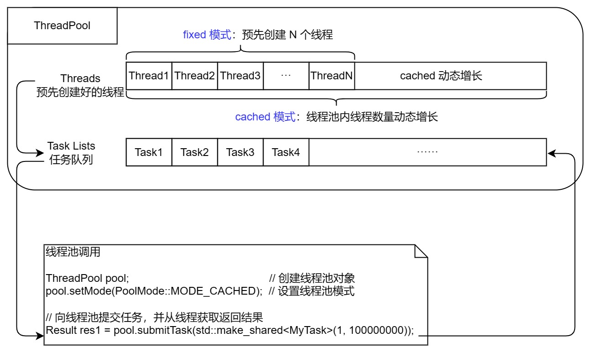

# 整体架构设计



## 提供给用户的接口

```c++
ThreadPool pool;                     // 定义线程池
pool.setMode(PoolMode::MODE_CACHED); // 设置线程池工作模式
pool.start(2);                       // 启动线程池（线程池内线程数量） 

// 用户自定义任务类，调用线程池接口向线程池提交任务
Result res1 = pool.submitTask(std::make_shared<MyTask>(1, 100000000));
```

## 线程池工作流程

1. 该 repo 线程池包含：线程列表 + 任务队列；
2. 用户向线程池提交任务，放于线程池的任务队列中；
3. 线程池的线程队列从任务队列中取任务执行；
4. 在 2、3 这个过程中，用户作为生产者向任务队列生产任务，线程列表作为消费者从任务队列中取任务消费，构成生产者消费者模型

## 技术栈分析

- 线程列表使用 `vector` 容器，可进行动态扩容；任务队列使用 `queue` 容器
- 用户向任务队列提交任务，线程列表从任务队列中取任务，需保证任务队列的原子操作。用到线程同步中的线程互斥操作，对任务队列进行加锁访问
- 用户与线程列表构成生产者消费者模型，用户提交任务时（生产）通知线程列表从任务队列中取任务（消费）。用到线程同步中的线程通信操作，使用条件变量、信号量
- 用户自定义的任务类继承自抽象任务类，重写自定义任务类的方法时，实现用户自定义的任务处理。继承中虚函数的多态
- 用户向线程池的任务队队列提交任务后，线程列表里的线程执行任务，返回值取决于用户定义的任务类。线程执行的返回值继承自 `Any` 类，继承时多态

## 线程池的 fixed 模式 与 cached 模式

- fixed 模式下：线程池内线程列表内线程数为固定值，默认为当前 CPU 核心数
- cached 模式下：根据任务数量和空闲线程数量（任务数量大于空闲线程数量，且当亲线程数量小于系统允许创建的最大线程数），动态创建新线程。
  - 适用于：任务处理比较紧急，小而快的任务
  - 不适用于：耗时的任务（因为长时间占用线程，导致系统线程创建过多）