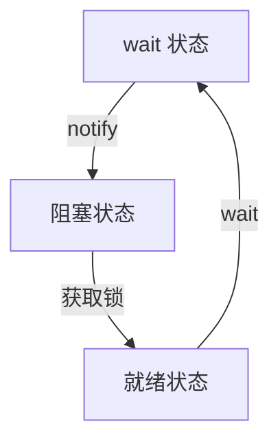

# 死锁问题记录

条件变量导致线程进入的状态：



## 分析

线程池出作用域未能析构

- 首先 review 线程池析构函数，对于线程池的线程列表执行的线程函数，析构函数可以处理两种情况

  - 因任务队列空，而阻塞的线程
  - 正在执行任务的线程

  死锁原因：``threads_.size() != 0`，`exitCond_`条件变量一直 `wait`

  ```c++
  ThreadPool::~ThreadPool() {
      isPoolRunning_ = false;
      notEmpty_.notify_all();
  
      // 等待线程池里面所有的线程返回
      // 线程池里面的线程有两种状态：阻塞、正在执行任务中
      std::unique_lock<std::mutex> lock(taskQueMtx_);
  
      exitCond_.wait(lock, [&]() -> bool { return threads_.size() == 0; });
  }
  ```

- review 线程池中线程列表线程执行的线程函数

  - 线程状态
    - 因任务队列空而等待，收到析构函数中的 `notEmpty_.notify_all();` ，由等待状态变到阻塞状态，获取到任务队列的锁才能继续运行，此前 `isPoolRunning_ = false;`，往下运行后 `threads_.erase(threadId); exitCond_.notify_all(); return;` 当前线程从线程列表删除后，就结束线程函数了，即结束当前线程了。`exitCond_` 条件变量唤醒析构函数线程，检查 `threads_.size() == 0;` 等于 0 即成功析构，大于 0 则继续等待
    - 正在执行任务，走出 `while (isPoolRunning_)` 循环后，`threads_.erase(threadId); exitCond_.notify_all();` 线程函数正常执行，线程池正常析构
    - 刚运行进 `while (isPoolRunning_)` 循环
      - `ThreadPool `所在线程先获取到任务队列的锁 `taskQueMtx_`：
        - 此时线程函数所在线程获取该锁失败，阻塞；
        - 而线程池所在线程的析构函数等待在条件变量 `exitCond_` 处，释放任务队列的锁 `taskQueMtx_`；
        - 线程函数所在线程获取到任务队列的锁成功，往下运行，进入任务队列`notEmpty_`条件变量的等待状态；析构函数已运行至 `exitCond_.wait(lock, [&]() -> bool { return threads_.size() == 0; });` 没有线程唤醒 `exitCond_` 这个条件变量；
        - 线程函数一直等待在 `notEmpty_`，析构函数一直等待在 `exitCond_`，即死锁
      - 线程函数所在线程先获取到任务队列的锁 `taskQueMtx_`：
        - 线程函数所在线程由就绪状态变为等待在条件变量 `notEmpty_`，释放锁；
        - 线程池所在线程析构函数获取到锁；
        - 没有线程唤醒 `notEmpty_`这个条件变量，死锁

  ```c++
  void ThreadPool::threadFunc(int threadId) {
  
      auto lastTime = std::chrono::high_resolution_clock().now();
  
      // 线程不断循环，从任务队列取任务
      while (isPoolRunning_) {
  		
          std::shared_ptr<Task> task;
  
          {
              std::unique_lock<std::mutex> lock(taskQueMtx_);
              std::cout << "tid: " << std::this_thread::get_id() << " 尝试获取任务..." << std::endl;
  
              while (isPoolRunning_ && taskQue_.size() == 0) {
  
                  // cached 模式，可能创建了很多线程
                  if (poolMode_ == PoolMode::MODE_CACHED) {
  					···
                  }
                  // fixed 模式
                  else {
                      // 【线程通信】等待 notEmpty_ 任务队列非空
                      notEmpty_.wait(lock);
                  }
              }
  
              // 线程池要结束，回收线程资源
              if (!isPoolRunning_) {
                  threads_.erase(threadId);
                  std::cout << "tid " << std::this_thread::get_id() << " exit!" << std::endl;
                  exitCond_.notify_all();
                  return;
              }
  
              idleThreadSize_--;
              std::cout << "tid: " << std::this_thread::get_id() << " 获取任务成功..." << std::endl;
              task = taskQue_.front();
              taskQue_.pop();
              taskSize_--;
  
              if (taskQue_.size() > 0) {
                  notEmpty_.notify_all();
              }
              notFull_.notify_all();
          }
  
          // 当前线程执行任务
          if (task != nullptr) {
              // 做两件事情：执行任务；把任务的返回值通过 Result 类的 setVal 方法给到 Result
              task->exec();
          }
  
          idleThreadSize_++;
          lastTime = std::chrono::high_resolution_clock().now();
      }
  
      threads_.erase(threadId);
      std::cout << "tid: " << std::this_thread::get_id() << " exit!" << std::endl;
      exitCond_.notify_all();
  }
  ```

  ## 修改

  - `ThreadPool `所在线程先获取锁：
    - `isPoolRunning_` 已经置为 false，线程函数无法进入 `while (isPoolRunning_ && taskQue_.size() == 0)`循环，不会因 `notEmpty_` 条件变量进入 wait 状态；
    - 线程函数所在线程往下运行 `if (!isPoolRunning_) { break; }` 跳出顶层 `while (isPoolRunning_)` 循环；
    - 线程函数所在线程往下运行，所在线程从线程列表删除，线程池正常析构
  - 线程函数所在线程先获取锁 ：
    - 线程函数所在线程因 `notEmpty_` 条件变量进入 wait 状态，释放锁；
    - `ThreadPool `所在线程获取锁，`notEmpty_` 条件变量 `notify`；
    - 线程函数所在线程接收到 `notify` 进入阻塞状态；
    - `ThreadPool `所在线程因 `exitCond_` 条件变量进入 wait 状态，释放锁；
    - 线程函数所在线程由阻塞状态转换为就绪状态，继续往下运行

  ```c++
  ThreadPool::~ThreadPool() {
      isPoolRunning_ = false;
      
      // 等待线程池里面所有的线程返回
      // 线程池里面的线程有两种状态：阻塞、正在执行任务中
      std::unique_lock<std::mutex> lock(taskQueMtx_);
      
      notEmpty_.notify_all();
  
      exitCond_.wait(lock, [&]() -> bool { return threads_.size() == 0; });
  }
  ```

  ```c++
  void ThreadPool::threadFunc(int threadId) {
  
      auto lastTime = std::chrono::high_resolution_clock().now();
  
      // 线程不断循环，从任务队列取任务
      while (isPoolRunning_) {
  
          std::shared_ptr<Task> task;
  
          {
              std::unique_lock<std::mutex> lock(taskQueMtx_);
              std::cout << "tid: " << std::this_thread::get_id() << " 尝试获取任务..." << std::endl;
  
              // 锁 + 双重判断
              while (isPoolRunning_ && taskQue_.size() == 0) {
  
                  // cached 模式
                  if (poolMode_ == PoolMode::MODE_CACHED) {
  					···
                  }
                  // fixed 模式
                  else {
                      notEmpty_.wait(lock);
                  }
              }
  
              // 线程池要结束，回收线程资源
              if (!isPoolRunning_) {
                  break;
              }
  
              idleThreadSize_--;
              std::cout << "tid: " << std::this_thread::get_id() << " 获取任务成功..." << std::endl;
              task = taskQue_.front();
              taskQue_.pop();
              taskSize_--;
  
              if (taskQue_.size() > 0) {
                  notEmpty_.notify_all();
              }
              notFull_.notify_all();
          }
  
          // 当前线程执行任务
          if (task != nullptr) {
              // 做两件事情：执行任务；把任务的返回值通过 Result 类的 setVal 方法给到 Result
              task->exec();
          }
          idleThreadSize_++;
          lastTime = std::chrono::high_resolution_clock().now();
      }
  
      threads_.erase(threadId);
      std::cout << "tid: " << std::this_thread::get_id() << " exit!" << std::endl;
      exitCond_.notify_all();
  }
  ```